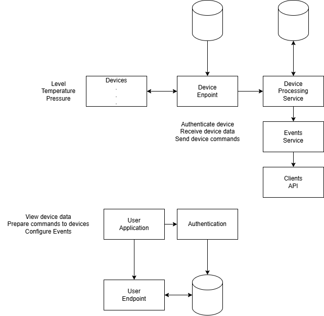

# River level monitoring app

## Description
Project for practicing web app development. Using Ruby on Rails as backend, Postgresql for Database and React as frontend.

## Functionalities
Users can have many devices collecting and for each device they can see river level and temperature filtered by date, send remote configuration commands, set alarms according to data threshold on ingestion.

## Screenshots

### Device selection menu
 -->

### Device sensors screen
 -->

<!-- ## System diagram
 -->